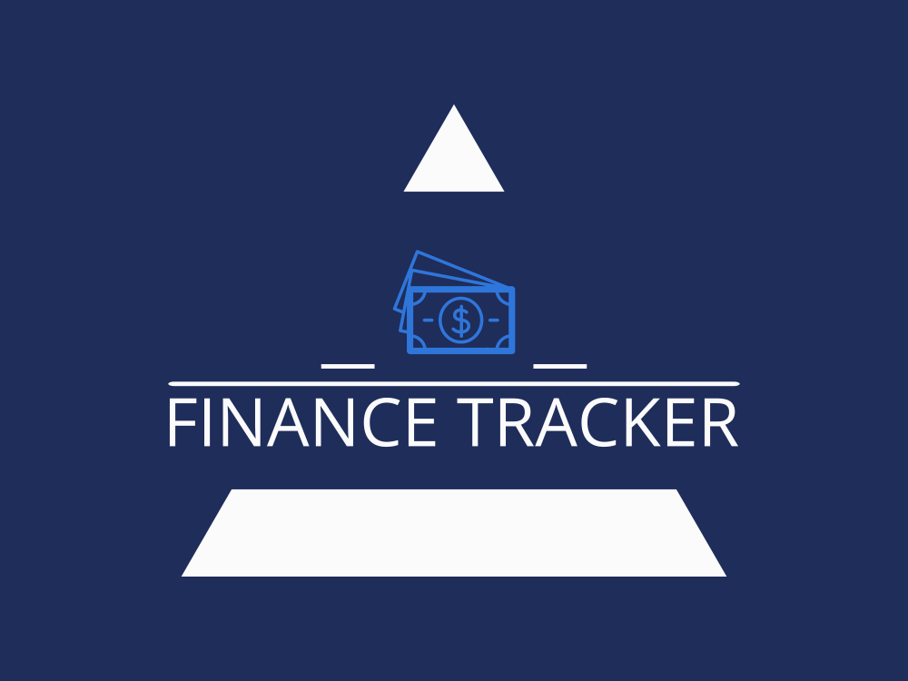

# Finance Tracker




Finance Tracker is a web application built with React using Vite as the development tool. It allows you to track your income and expenses, manage transactions, and calculate the total amount in different currencies.

## Installation

Before running the application, make sure you have Node.js and npm installed on your machine. Then, follow these steps:

1. Clone the repository:

   ```shell
   git clone <repository-url>
2. Navigate to the project directory:

    ```shell
    cd finance-tracker
3. Install the dependencies:

    ```shell
    npm install
## Development

To start the development server and run the application, use the following command:

    npm run dev
    

The application will be available at http://localhost:5173.


## Features

* Add income and expense transactions
* Edit and delete existing transactions
* View a list of transactions with details
* Search transactions by description
* Calculate the total amount in the selected base currency
* Fetch real-time exchange rates 
* React
* Vite
* Tailwind CSS


